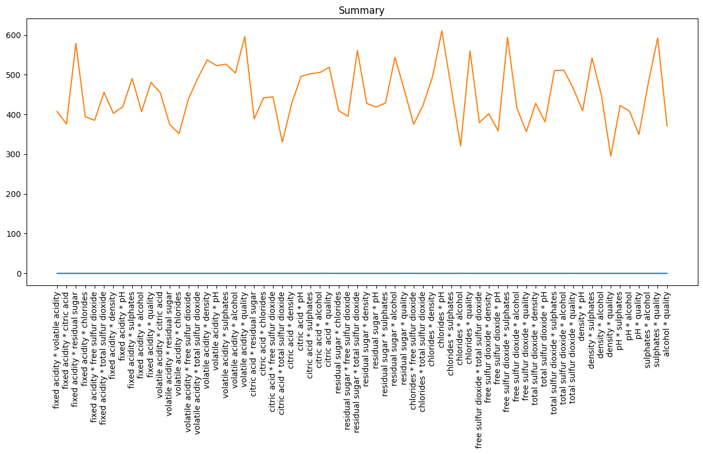
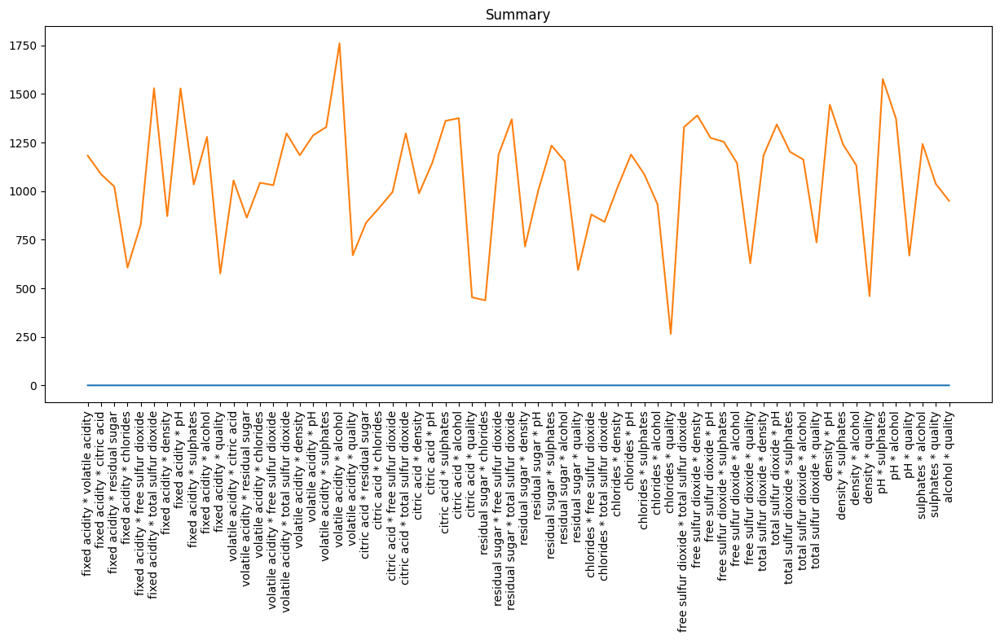
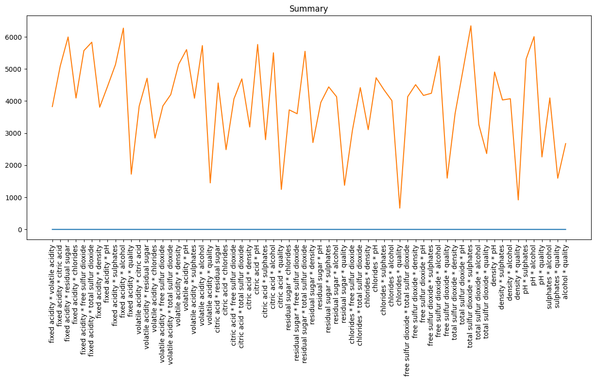
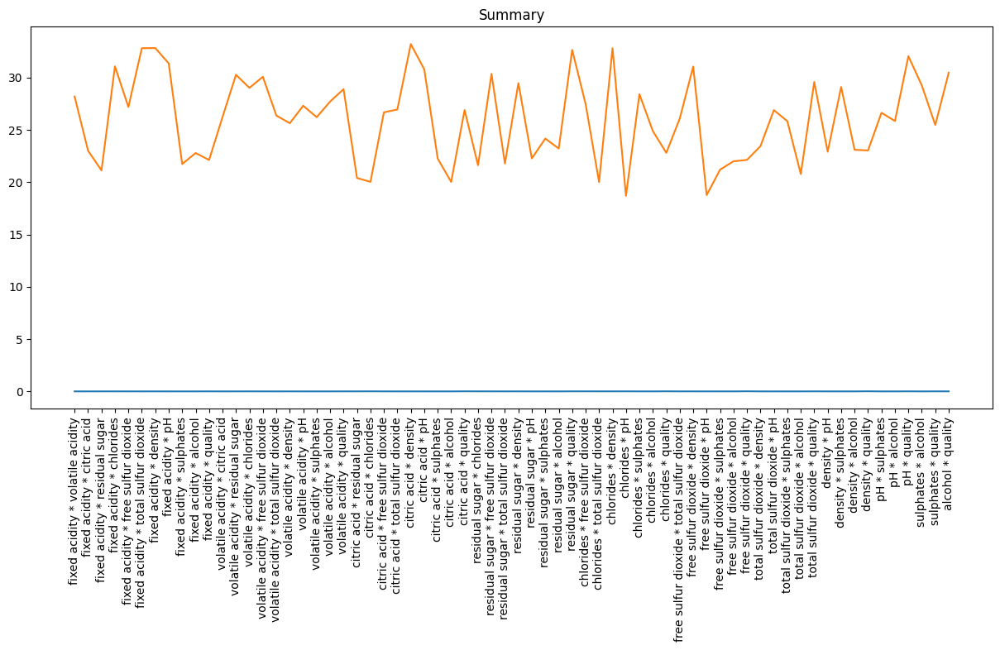
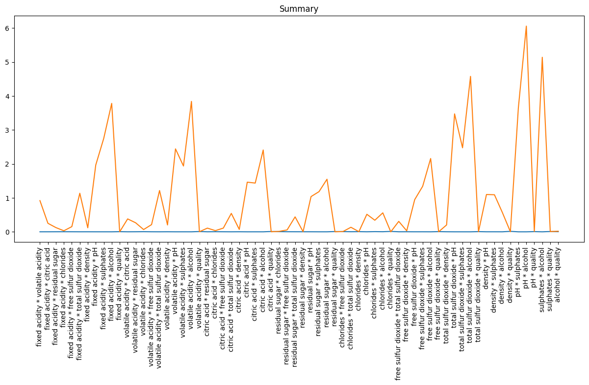
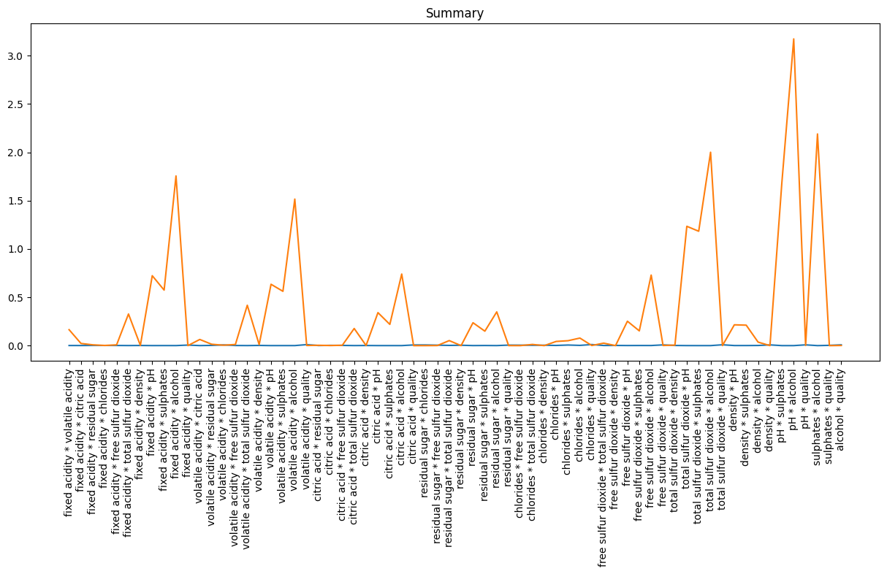
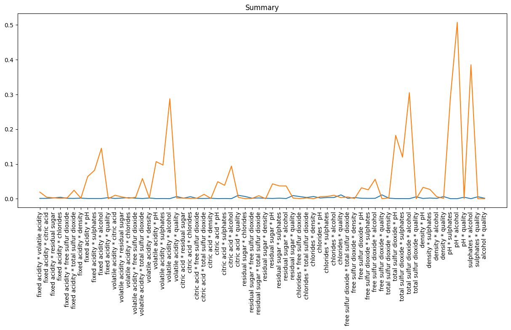
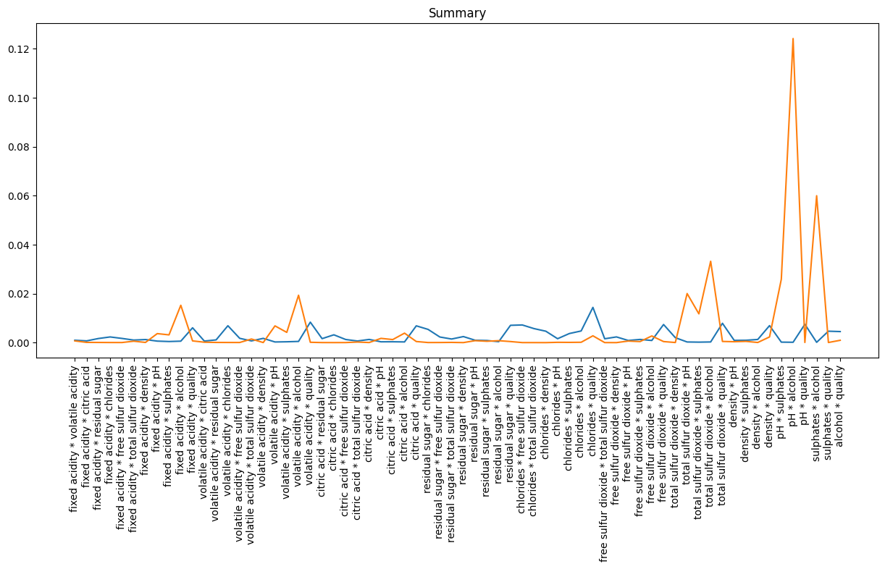

# Report

## Summary

This experiment compares the 2D histogram method (where the uniform assumption is applied) and cout-min sketch. The result indicates that the naive count-min sketch cannot guarantee a proper bound when facing range queries (especially when most tags has reletively few objects).

## Problem specification

For a 2-column table `T[(x,y)]` and query `Q(qx, qy)`, calculate:

```sql
SELECT COUNT(*) FROM T
WHERE x <= qx
AND y <= qy
```

## 2D Histogram

The generation of a 2D Histogram is trival. We only care about the quantized query:

$$
\begin{cases}
    q_x &= id_x + r_x\\
    q_y &= id_y + r_y
\end{cases}
$$

And we have:

$$
\mathrm{Est}(Q) = \sum_{1 \leqslant i \leqslant N, 1 \leqslant j \leqslant N} w_{i, j}\mathrm{Hist}[i][j]
$$

Where $N$ is the amount of bin among one variable. $w_{i, j}$ is the weight determined by query, where:

$$
w_{i, j} = \begin{cases}
    1 & 0 \leqslant i < q_x \land 0 \leqslant j < q_y \\
    r_x & i = q_x \land 0 \leqslant j < q_y \\
    r_y & 0 \leqslant i < q_x \land j = q_y \\
    r_xr_y & i = q_x \land j = q_y \\
    0 & \mathrm{Otherwise} 
\end{cases}
$$

## Count-Min sketch

A intuitive way to imporve the accuracy of 2D Histogram method is to increase $N$, which the the bins allocated on each axis. However, this also means comsuming more memory. Another intuitive way to avoid this shortcomming is to do some sort of compression. We choose count-min sketch.

Seemingly, we apply bigger $N$ to 2D histogram, we use $N' = N^2$.

Then, we can derive:

$$
\mathrm{Est}(Q) = \sum_{1 \leqslant i \leqslant N', 1 \leqslant j \leqslant N'} w_{i, j}\mathrm{LookUp}(\mathrm{Embbeding}(i, j))
$$

It has the similar form as above. Where `LookUp(Key)` is look-up operation in count-min sketch, and `Embbeding(i, j)` means to generate a unique key for different `(i, j)` pairs, it could be a string `"i, j"` or some integer `i * N' + j`.

## Experiment configuration:

We define some constants as follow:

```cpp
#define N_BINS 8
#define N_BINS_SKETCH 64
#define N_QUERIES 100
```

And we will discuss the infection on the width and depth of the `CW` matrix.

## Results

### Experiment on keeping the same size with 2D Histogram

CW Matrix : `64 * 1`



CW Matrix : `32 * 2`



CW Matrix : `16 * 4`



#### Conclution

Such results indicates that keeping the same size as the 2D histogram while attemping to be accurate is nearly impossible when using count-min sketch.

### Experiment on enlarging width and depth

CW Matrix : `256 * 1`



CW Matrix : `256 * 5`



CW Matrix : `256 * 10`



CW Matrix : `512 * 5`



CW Matrix : `512 * 10`



#### Conclution

The results indicates that the incresing of width and depth can lead to significant contribution on accuracy, the cost is however too large to bear. Further, according the results, this configuration is not yet stable or optimal.